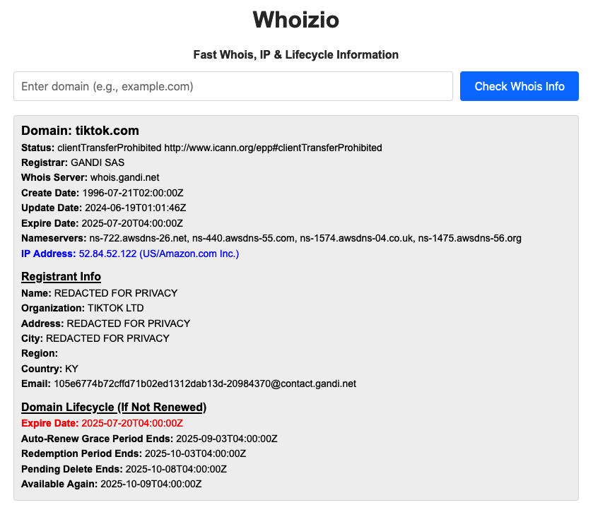

# Whoizio - Domain & IP Information Lookup

**Whoizio** is a simple yet powerful PHP web application that allows you to retrieve domain registration information (WHOIS), IP address details, and lifecycle data for a domain (if it expires). This tool leverages the **ip2location.io** API to provide domain ownership information, IP geolocation, network details, and more.



## Features

- **Domain WHOIS Information**: View domain registration details including the registrar, creation date, update date, and expiration date.
- **IP Address & Network Info**: Retrieve detailed IP information such as country, city, network organization, and more.
- **Domain Lifecycle**: Determine the stages of a domain's lifecycle, such as Auto Renewal, Redemption Period, Pending Delete, etc., based on the expiration date.
- **Simple Interface**: A clean, responsive interface for easy access to WHOIS and IP details.
- **Free API Key**: Powered by the **ip2location.io** API.

## Benefits

- **Domain Ownership Insights**: Understand who owns a domain and get contact information.
- **IP & Network Information**: See the geographical location and organization associated with an IP address.
- **Expiration & Renewal Tracking**: Get detailed information about when a domain will expire and the possible lifecycle stages if not renewed.
- **Developer-Friendly**: Simple PHP code using cURL to integrate domain and IP lookups into your own projects.

## Technology Stack

- **PHP (Native)**: Backend scripting language.
- **cURL**: Used to interact with the ip2location.io API.
- **ip2location.io API**: Provides detailed domain and IP information.

## Installation

1. Clone or download the repository:

   ```
   git clone https://github.com/cedonulfi/whoizio.git
   ```

2. Make sure you have PHP and cURL enabled on your server.

3. Sign up for an API key from **ip2location.io** [here](https://www.ip2location.io/sign-up).

4. Replace the `$apiKey` variable in the `index.php` file with your API key.

5. Upload the files to your web server and navigate to `index.php` to start using Whoizio.

## Example Usage

Simply enter the domain name in the input form, and click "Check Whois" to see the domain's registration info, IP address, and network details.

## License

MIT License. See [LICENSE](LICENSE) for details.

## Feedback & Contributions

Feel free to open issues or submit pull requests if you have any suggestions or improvements for Whoizio. All constructive feedback is welcomed!

---

**Whoizio** may be simple, but it's a highly useful tool for anyone involved with domains, IP addresses, and network information. Whether you're a developer, system administrator, or just someone curious about domain data, this app has you covered.

